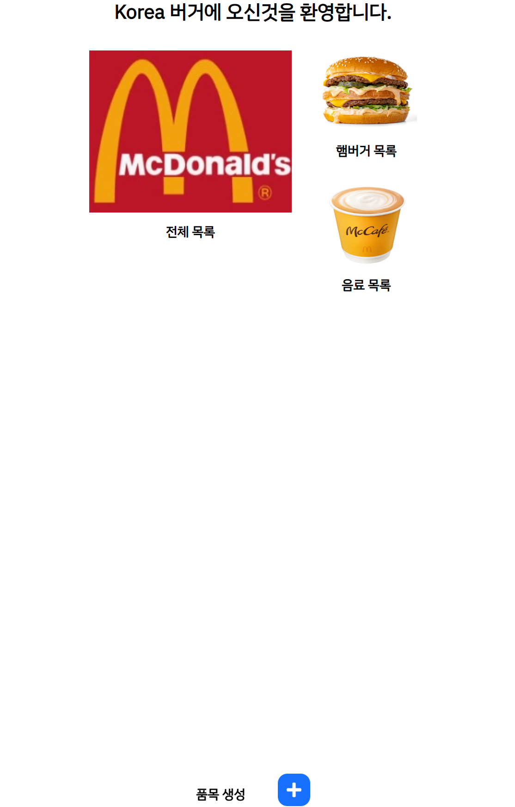
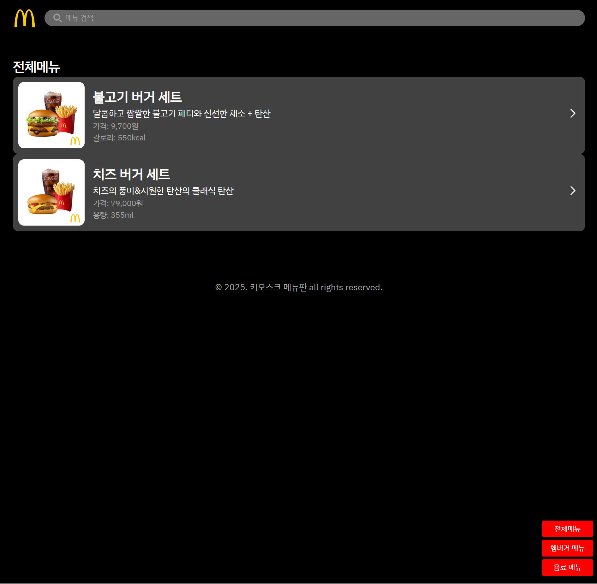
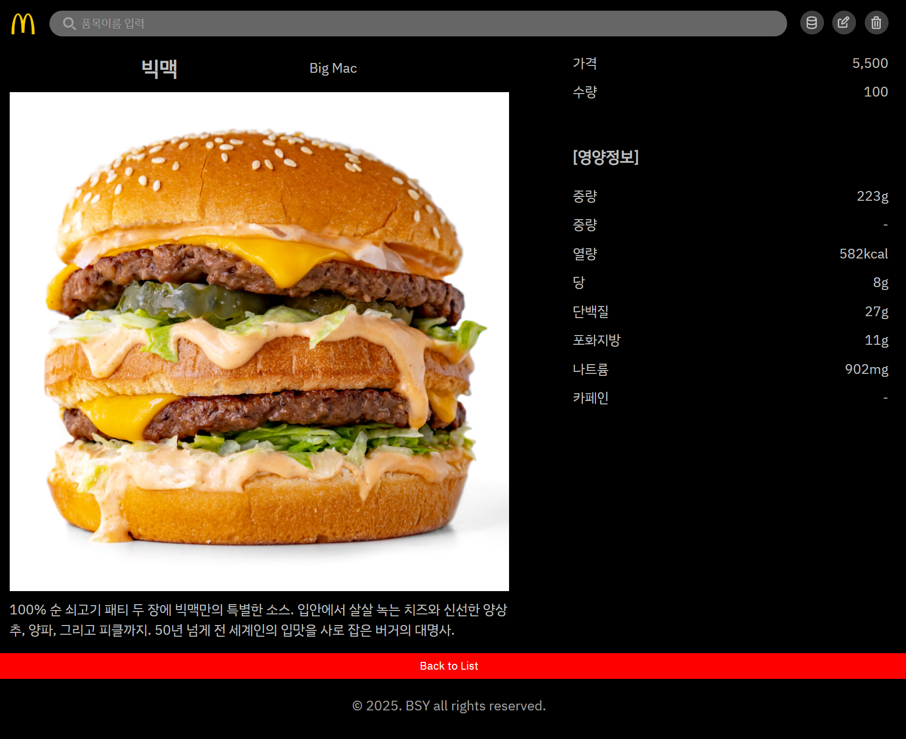
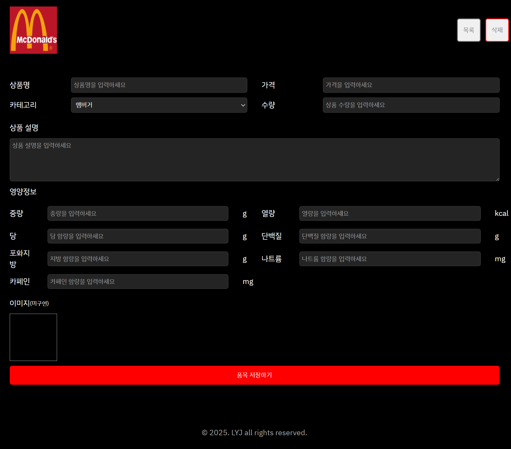

# 📌 프로젝트명: 햄버거 키오스크

> 본 프로젝트는 **React, JavaScript, CSS, HTML**을 기반으로 제작된 SPA 방식의 CRUD 대시보드입니다.  
> 햄버거 품목의 생성, 조회, 수정, 삭제 기능을 통해 컴포넌트 기반 개발, 상태 관리, 라우팅, 비동기 처리 등 React의 핵심 개념을 실습하며,  
> 키오스크 UI 스타일의 실제 제품 환경을 시각적으로 구현하는 데 집중하였습니다.

---

## 📅 프로젝트 기간

- **시작일:** 2025.07.13  
- **종료일:** 2025.07.31

---

## 🎯 프로젝트 목표

- ✅ React 컴포넌트 구조 설계 및 분리 실습
- ✅ 상태 기반 CRUD 기능 구현 (useState, useEffect 등)
- ✅ React Router를 통한 페이지 라우팅 구성
- ✅ 사용자 친화적인 키오스크 UI 디자인 설계
- ✅ 컴포넌트 재사용성과 유지보수성을 고려한 개발

---

## 🛠️ 사용 기술 스택

| 구분       | 기술 상세                                 |
|------------|--------------------------------------------|
| Frontend   | React, TypeScript, HTML, CSS               |
| State Mgmt | useState, useEffect (React Hooks)          |
| Routing    | React Router DOM                           |
| Style      | CSS Modules, Flexbox, Grid, Media Query    |
| Dev Tools  | VSCode, GitHub, Chrome DevTools, Vite      |

---

## 📁 프로젝트 폴더 구조

```bash
📁 src/
├── 📁 assets/               # 이미지, 아이콘 등 정적 리소스
│   └── logo.svg
│
├── 📁 components/           # 재사용 컴포넌트
│   └── ItemCard.tsx
│   └── ItemCard.module.css
│
├── 📁 pages/                # 각 라우트 단위 페이지
│   ├── MainPage.tsx
│   ├── ListPage.tsx
│   ├── DetailPage.tsx
│   ├── CreatePage.tsx
│   ├── MainPage.module.css
│   ├── ListPage.module.css
│   ├── DetailPage.module.css
│   └── CreatePage.module.css
│
├── 📁 routes/               # 라우팅 정의
│   └── AppRouter.tsx
│
├── 📁 types/                # 전역 타입 정의
│   └── item.ts
│
├── App.tsx
├── App.css
├── index.tsx
├── index.css
├── react-app-env.d.ts
├── reportWebVitals.ts
└── setupTests.ts

```

## ✨ 주요 기능 설명

### 🏠 1. 메인 대시보드 (`MainPage.jsx`)
- 전체 목록, 햄버거 목록, 음료 목록으로 이동할 수 있는 진입 페이지
- 각 카테고리별 섹션으로 이동 가능한 버튼 및 이미지
- 하단에 ‘품목 생성’ 버튼 고정 (Floating Button)

---

### 📋 2. 전체 목록 페이지 (`ListPage.jsx`)
- 등록된 모든 품목을 카드 형태로 출력
- `useEffect`를 통해 로컬 저장소 또는 mock data 불러오기
- 검색 기능 구현 (품목명 기반 필터링)
- 카테고리별 필터 버튼 (햄버거 / 음료)

---

### 🔍 3. 품목 상세보기 페이지 (`DetailPage.jsx`)
- 선택된 품목의 이미지, 이름, 설명, 가격, 수량, 영양정보를 상세하게 출력
- 상단에 ‘수정’, ‘삭제’ 버튼 배치
- 삭제 시 confirm 처리 후 메인 페이지 이동

---

### ✏️ 4. 품목 생성 / 수정 페이지 (`CreatePage.jsx`)
- 입력 폼을 통해 상품명, 가격, 카테고리, 수량, 설명, 영양정보 입력
- 각 필드에 `placeholder`와 단위 안내 포함
- 저장 시 `useState` 및 `localStorage` 기반 상태 업데이트
- 수정 시 기존 데이터 사전 입력 (edit mode)

---

## 🖼️ 데모 화면 캡처

| 주요 기능     | 화면 예시                        |
|--------------|-------------------------------|
| 메인 대시보드 |      |
| 전체 목록     |      |
| 상세 보기     |  |
| 품목 생성     |  |


---

## 👨‍💻 개발자

| 이름   | GitHub                                                  |
|--------|----------------------------------------------------------|
| 이용준 | [https://github.com/yongjun1994](https://github.com/yongjun1994) |
