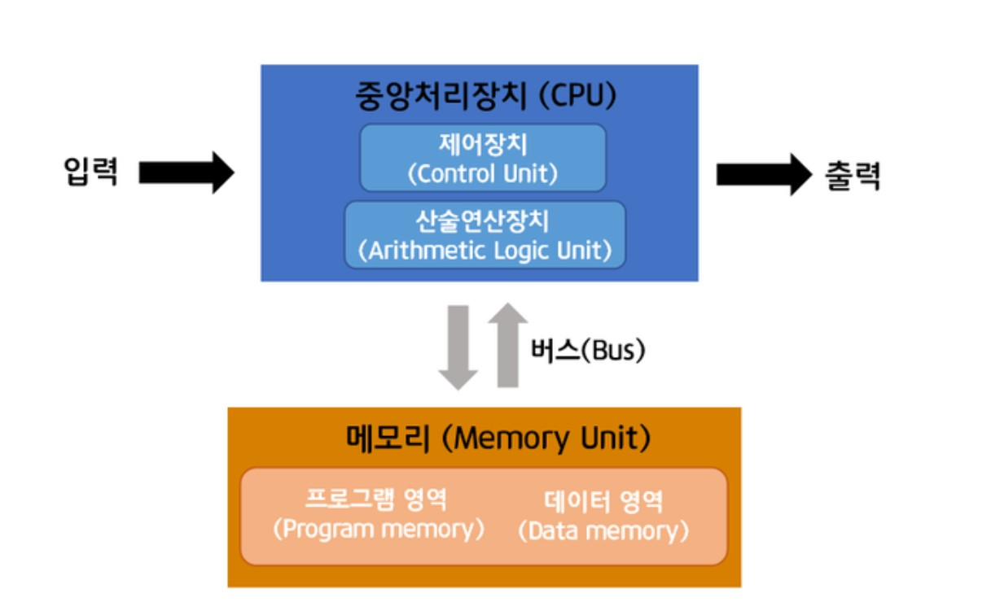

# 컴퓨터공학 이론과제 : 컴퓨터의 작동 원리: 폰 노이만 구조

## 1) 🌟 폰 노이만 구조란?

폰 노이만 구조(Neumann architecture)는 현대 컴퓨터의 기본 작동 원리를 제시한 설계 방식이다.  
1945년 존 폰 노이만(John von Neumann) 박사가 제안.

> 핵심 아이디어  
> "프로그램도 데이터처럼 메모리에 저장하자."

### 장점
- 다양한 프로그램 실행 가능
- 설계가 단순하고 범용성이 높음

### 단점
- CPU와 메모리 간 병목 현상 발생 가능 (Neumann Bottleneck)

---

## 2) 폰 노이만 구조의 구성 요소




| 구성 요소           | 역할 |
|---------------------|------|
| 중앙처리장치(CPU)   | 계산과 제어 담당 |
| 메모리(주기억장치)  | 프로그램과 데이터 저장 |
| 입력장치             | 사용자로부터 데이터 입력 |
| 출력장치             | 결과 출력 |
| 제어버스, 데이터버스 | 구성요소 간 데이터/제어 신호 전달 |

### CPU 내부 구성
- **연산논리장치(ALU)** : 계산, 논리 연산 처리
- **제어장치(Control Unit)** : 명령 해석 및 실행 지시
- **레지스터(Register)** : 초고속 임시 저장소
- **클럭(Clock)** : CPU 작업 속도 조절

---

## 3) 폰 노이만 사이클 (명령어 처리 흐름)

1. **명령어 읽기(Fetch)** : 메모리에서 명령어 읽기
2. **명령어 해석(Decode)** : 명령어 해석
3. **명령어 실행(Execute)** : 연산 및 작업 수행
4. **결과 저장(Store)** : 결과를 메모리에 저장

→ **반복 실행**

---

## 4) 폰 노이만 구조 vs 하버드 구조

| 구분               | 폰 노이만 구조 | 하버드 구조 |
|--------------------|----------------|-------------|
| 명령어 저장 방식    | 명령어 + 데이터 **같은 메모리** | 명령어 + 데이터 **분리된 메모리** |
| 장점                | 설계 단순, 범용성 높음 | 빠른 처리 속도 가능 |
| 단점                | 병목 현상 발생 가능성 | 설계 복잡, 비용 증가 |
| 주요 사용처         | 일반 PC, 노트북, 서버 | 임베디드 시스템, DSP 등 |

---

## 5) 폰 노이만 병목 해결 기술

### 가) 캐시 메모리 (Cache)
- CPU 내부에 고속 메모리 추가 → 메모리 접근 속도 향상

### 나) 파이프라인 (Pipeline)
- 명령어를 여러 단계로 나눠서 겹쳐 처리 → 처리 효율 향상

---

## 6) 최신 컴퓨터 구조 (폰 노이만 구조 보완)

| 구조               | 특징 |
|--------------------|------|
| 병렬 처리 구조 (멀티코어) | CPU 여러 개로 동시에 처리 |
| GPU (그래픽 처리 장치)   | 수천 개의 작은 코어로 병렬 처리 |
| AI 가속기 (Neural Engine 등) | 인공지능 연산 전용 하드웨어 |

---

## 7) 실제 사례

- **Windows PC, Mac, Linux 서버, 스마트폰** 등 대부분의 범용 컴퓨터가 기본적으로 **폰 노이만 구조**를 기반으로 설계됨.

---

## 🌟 요약

> **폰 노이만 구조** 덕분에 컴퓨터는 "프로그램을 메모리에 올리고 CPU가 순차적으로 처리"할 수 있게 되었고,  
> 현대 컴퓨터는 이를 기본으로 유지하면서 **성능 향상을 위한 보완 기술**(캐시, 파이프라인, 멀티코어 등)을 적용해 사용 중이다.

---

# 웹개발 이론과제 : HTML 시맨틱 태그 역할 및 접근성 향상 방법 정리, DOM 조사

## 1) HTML 시맨틱 태그 역할

### 🌟 시맨틱(Semantic) 태그란?

**Semantic** = "의미론적인", 즉 **의미를 가진** 태그.

> 시맨틱 태그는 **구조 + 의미**를 함께 전달하는 HTML 태그입니다.

### 주요 목적

- **사람과 기계(브라우저, 검색 엔진, 스크린 리더)**가 **페이지 구조**를 쉽게 이해
- **SEO(검색엔진 최적화)**에 도움
- **웹 접근성** 향상 → 장애인 사용자도 사이트를 효과적으로 이용 가능
- **유지보수 용이** → 협업 시 코드 가독성 증가

### 대표 시맨틱 태그와 역할

| 태그           | 의미 및 역할 |
|----------------|--------------|
| `<header>`     | 문서나 섹션의 머리말(로고, 내비게이션 등) |
| `<nav>`        | 주요 내비게이션 메뉴 |
| `<main>`       | 문서의 핵심 콘텐츠(하나의 문서에 한 번만 사용) |
| `<section>`    | 문서 내 독립적인 주제별 영역 |
| `<article>`    | 독립적으로 배포/재사용 가능한 콘텐츠(뉴스 기사, 블로그 글 등) |
| `<aside>`      | 보조 콘텐츠(광고, 사이드바 등) |
| `<footer>`     | 문서나 섹션의 바닥글(저작권 정보, 연락처 등) |
| `<figure>`, `<figcaption>` | 이미지, 도표 등에 대한 설명 포함 |
| `<mark>`       | 강조(형광펜 효과) |
| `<time>`       | 날짜와 시간 표현 |

### 시맨틱 태그 사용 예시

```html
<main>
  <header>
    <h1>나의 블로그</h1>
    <nav>
      <ul>
        <li>홈</li>
        <li>소개</li>
        <li>문의</li>
      </ul>
    </nav>
  </header>

  <section>
    <article>
      <h2>오늘의 포스트</h2>
      <p>HTML 시맨틱 태그에 대해 알아봅니다.</p>
    </article>
  </section>

  <aside>
    <p>광고 또는 추천 글</p>
  </aside>

  <footer>
    &copy; 2025 나의 블로그
  </footer>
</main>
```

---

## 2) 접근성 향상 방법

### 🌟 웹 접근성이란?

**웹 접근성(Web Accessibility)** =  
모든 사용자가 장애 유무에 관계없이 웹 콘텐츠를 이용할 수 있도록 하는 것.

###  시맨틱 태그 활용 시 접근성 향상 효과

- `<nav>` → 스크린 리더가 "내비게이션 영역"임을 인식
- `<main>` → 페이지의 **핵심 콘텐츠**임을 인식
- `<article>` → **독립적인 콘텐츠 영역**임을 인식
- `<section>` → 논리적 구분된 영역으로 인식
- `<header>`, `<footer>` → 상단, 하단 영역으로 인식

### 추가 접근성 향상 방법

| 방법                   | 설명 |
|------------------------|------|
| **alt 속성 사용**      | 이미지에 대한 **대체 텍스트** 제공 `` |
| **label 연결**         | `<label for="id">`로 **폼 요소에 라벨**을 연결 |
| **명확한 링크 텍스트** | "여기를 클릭" → "자세히 보기"처럼 **구체적 설명** 제공 |
| **키보드 네비게이션 지원** | Tab 키로 모든 **인터랙티브 요소**에 접근 가능하도록 구현 |
| **WAI-ARIA 속성 사용** | 필요한 경우 `role`, `aria-label` 등으로 **추가 설명** 제공 |

---

## 3) DOM (Document Object Model)

### 🌟 DOM이란?

**Document Object Model**  
👉 브라우저가 HTML 페이지를 읽으면 → **트리 구조 형태로 내부적으로 표현**한 것.  
👉 DOM 덕분에 **JavaScript로 HTML 요소를 조작**할 수 있습니다.

### DOM 구조 예시

```html
<body>
  <h1>제목</h1>
  <p>문단입니다.</p>
</body>
```

→ DOM 트리:

```
Document
└── html
    ├── head
    └── body
        ├── h1
        └── p
```

### DOM 역할

- **HTML 문서 구조화**  
- **JavaScript로 조작 가능**:
  - 텍스트 변경
  - 스타일 변경
  - 요소 추가/삭제
  - 이벤트 처리(클릭, 마우스 이동 등)

### DOM 조작 예제 (JavaScript)

```html
<h1 id="title">Hello</h1>
<button onclick="changeTitle()">변경</button>

<script>
function changeTitle() {
  document.getElementById("title").innerText = "안녕하세요!";
}
</script>
```

> 버튼 클릭 시 **DOM을 통해 `<h1>` 텍스트가 변경**됨.

---

## 최종 한눈에 정리

| 항목              | 핵심 내용 |
|-------------------|-----------|
| HTML 시맨틱 태그  | 의미가 명확한 태그로 **문서 구조**를 표현 |
| 접근성 향상 방법   | 시맨틱 태그 사용 + alt, label, 명확한 텍스트, 키보드 접근 지원 |
| DOM               | HTML 문서를 트리 구조로 표현 + JS로 조작 가능 |

---

## 🌟 요약

👉 **HTML 시맨틱 태그**를 사용하면 문서 구조가 명확해지고,  
👉 **웹 접근성**을 향상시켜 장애 유무와 관계없이 더 많은 사용자가 웹을 이용할 수 있다.  
👉 **DOM**은 HTML 문서를 브라우저가 이해하고 **JS로 조작할 수 있도록 만드는 구조**이다.

---


